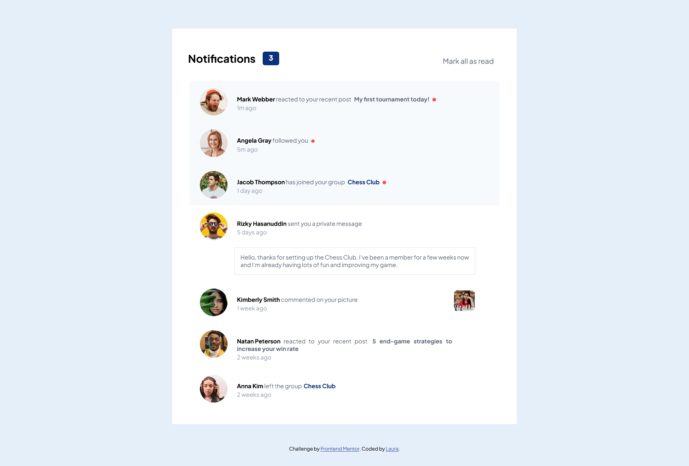

# Frontend Mentor - Notifications page solution

This is a solution to the [Notifications page challenge on Frontend Mentor](https://www.frontendmentor.io/challenges/notifications-page-DqK5QAmKbC). Frontend Mentor challenges help you improve your coding skills by building realistic projects. 

## Table of contents

- [Overview](#overview)
  - [The challenge](#the-challenge)
  - [Screenshot](#screenshot)
  - [Links](#links)
- [My process](#my-process)
  - [Built with](#built-with)
  - [What I learned](#what-i-learned)
  - [Continued development](#continued-development)
- [Author](#author)

## Overview

### The challenge

Users should be able to:

- Distinguish between "unread" and "read" notifications
- Select "Mark all as read" to toggle the visual state of the unread notifications and set the number of unread messages to zero
- View the optimal layout for the interface depending on their device's screen size
- See hover and focus states for all interactive elements on the page

### Screenshot

### Links

- Solution URL: [Github Repository](https://github.com/xliquidskyx/Notification-Page)
- Live Site URL: [Add live site URL here](https://your-live-site-url.com)

## My process

### Built with

- Semantic HTML5 markup
- CSS custom properties
- Flexbox
- Mobile-first workflow
- Vanilla Javascript

**Note: These are just examples. Delete this note and replace the list above with your own choices**

### What I learned

I have learned about CSS custom properties and used them for the first time in my project and worked on my Javascript skills more.

**Note: Delete this note and the content within this section and replace with your own learnings.**

### Continued development

I'll keep on using custom properties in my future projects and I'm planning on learning SASS as well.

## Author

- Website - [Github](https://github.com/xliquidskyx)
- Frontend Mentor - [@xliqudiskyx](https://www.frontendmentor.io/profile/xliquidskyx)
